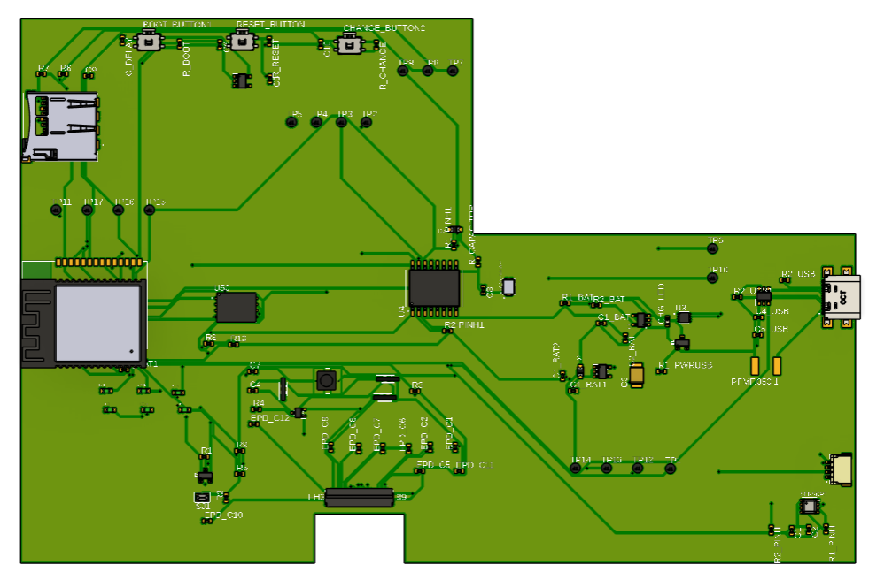
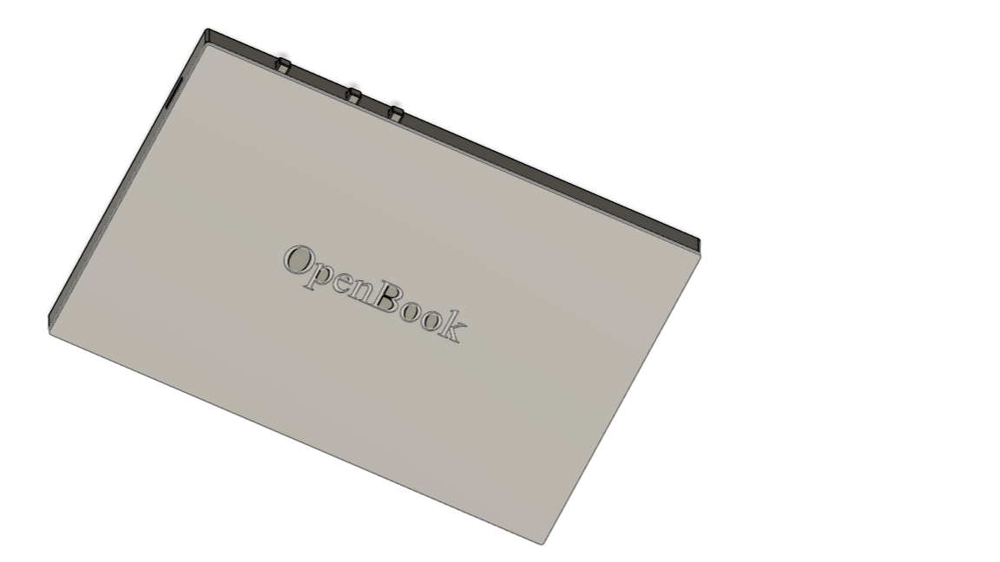

# DeskAssistant v1.5 – README

## Diagrama bloc

---

## Bill of Materials (BoM)

# Bill of Materials

| Componenta | Link |
|------------|------|
| ESP32_WROVER_EAGLE-LTSPICE_RR0402 | [https://www.snapeda.com/parts/RC0402FR-07226RL/Yageo/view-part/](https://www.snapeda.com/parts/RC0402FR-07226RL/Yageo/view-part/) |
| QWIIC_CONNECTORJS-1MM | [https://www.snapeda.com/parts/PRT-14417/SparkFun/view-part/](https://www.snapeda.com/parts/PRT-14417/SparkFun/view-part/) |
| BUTTON_CUSYOMV1 | [https://industry.panasonic.com/global/en/downloads?tab=cad&small_g_cd=203&part_no=EVQPUJ02K&q=RVZRUFVKMDJLJTdDMTMlN0MyMDMlN0MzNDU5JTdDMSU3QyU3QyU3Q2ZhbHNl](https://industry.panasonic.com/global/en/downloads?tab=cad&small_g_cd=203&part_no=EVQPUJ02K&q=RVZRUFVKMDJLJTdDMTMlN0MyMDMlN0MzNDU5JTdDMSU3QyU3QyU3Q2ZhbHNl) |
| ESP32_WROVER_EAGLE-LTSPICE_CC0402 | [https://componentsearchengine.com/part-view/CC0402MRX5R5BB106/YAGEO](https://componentsearchengine.com/part-view/CC0402MRX5R5BB106/YAGEO) |
| CPH3225A | [https://www.snapeda.com/parts/CPH3225A/Seiko+Instruments/view-part/?ref=eda](https://www.snapeda.com/parts/CPH3225A/Seiko+Instruments/view-part/?ref=eda) |
| ADAFRUIT_LEDCHIP-LED0603 | [https://www.snapeda.com/parts/KP-1608SURCK/Kingbright/view-part/?ref=search&t=LED%200603](https://www.snapeda.com/parts/KP-1608SURCK/Kingbright/view-part/?ref=search&t=LED%200603) |
| 112A-TAAR-R03_ATTEND | [https://store.comet.bg/en/Catalogue/Product/43497/](https://store.comet.bg/en/Catalogue/Product/43497/) |
| 744043680IND_4828-WE-TPC_WRE | [https://www.digikey.sg/en/models/1638515](https://www.digikey.sg/en/models/1638515) |
| BD5229G-TR | [https://componentsearchengine.com/part-view/BD5229G-TR/ROHM%20Semiconductor](https://componentsearchengine.com/part-view/BD5229G-TR/ROHM%20Semiconductor) |
| DS3231SN | [https://www.snapeda.com/parts/DS3231SN%23/Analog+Devices/view-part/?ref=eda](https://www.snapeda.com/parts/DS3231SN%23/Analog+Devices/view-part/?ref=eda) |
| ESP32-C6-WROOM-1-N8 | [https://www.snapeda.com/parts/ESP32-C6-WROOM-1-N8/Espressif+Systems/view-part/?ref=eda](https://www.snapeda.com/parts/ESP32-C6-WROOM-1-N8/Espressif+Systems/view-part/?ref=eda) |
| MCP73831 | [https://www.digikey.com/en/models/1874108](https://www.digikey.com/en/models/1874108) |
| ESP32_WROVER_BME680_BME680 | [https://www.snapeda.com/parts/BME680/Bosch/view-part/?welcome=home](https://www.snapeda.com/parts/BME680/Bosch/view-part/?welcome=home) |
| ESP32_WROVER_SPARKFUN-DISCRETESEMI_MOSFET_PCH-DMG2305UX-7 | [https://componentsearchengine.com/part-view/DMG2305UX-7/Diodes%20Incorporated](https://componentsearchengine.com/part-view/DMG2305UX-7/Diodes%20Incorporated) |
| ESP32C6_VARISTORCN1812 | [https://www.mouser.co.uk/ProductDetail/EPCOS-TDK/B72520T0350K062?qs=dEfas%2FXlABIszF52uu7vrg%3D%3D](https://www.mouser.co.uk/ProductDetail/EPCOS-TDK/B72520T0350K062?qs=dEfas%2FXlABIszF52uu7vrg%3D%3D) |
| FH34SRJ-24S-0.5SH_99_ | [https://componentsearchengine.com/part-view/XC6220A331MR-G/Torex](https://componentsearchengine.com/part-view/XC6220A331MR-G/Torex) |
| MAX17048G+T10 | [https://www.snapeda.com/parts/MAX17048G+T10/Analog+Devices/view-part/?ref=eda](https://www.snapeda.com/parts/MAX17048G+T10/Analog+Devices/view-part/?ref=eda) |
| MBR0530 | [https://ro.mouser.com/ProductDetail/KYOCERA-AVX/SD0805S020S1R0?qs=jCA%252BPfw4LHbpkAoSnwrdjw%3D%3D](https://ro.mouser.com/ProductDetail/KYOCERA-AVX/SD0805S020S1R0?qs=jCA%252BPfw4LHbpkAoSnwrdjw%3D%3D) |
| PGB1010603MR | [https://www.snapeda.com/parts/PGB1010603MR/Littelfuse/view-part/?ref=eda](https://www.snapeda.com/parts/PGB1010603MR/Littelfuse/view-part/?ref=eda) |
| RCL_CPOL-EUCT3528 | [https://ro.mouser.com/ProductDetail/Vishay-Sprague/TR3B106K025C1300?qs=jCGqFXxTmLdffnuDkXzk1g%3D%3D](https://ro.mouser.com/ProductDetail/Vishay-Sprague/TR3B106K025C1300?qs=jCGqFXxTmLdffnuDkXzk1g%3D%3D) |
| SAMACSYS_PARTS_USB4110-GF-A | [https://componentsearchengine.com/part-view/USB4110-GF-A/GCT%20(GLOBAL%20CONNECTOR%20TECHNOLOGY)](https://componentsearchengine.com/part-view/USB4110-GF-A/GCT%20(GLOBAL%20CONNECTOR%20TECHNOLOGY)) |
| SI1308EDL-T1-GE3 | [https://componentsearchengine.com/part-view/SI1308EDL-T1-GE3/Vishay](https://componentsearchengine.com/part-view/SI1308EDL-T1-GE3/Vishay) |
| SJ | [https://grabcad.com/library/solder-jumpers-1](https://grabcad.com/library/solder-jumpers-1) |
| USBLC6-2SC6Y | [https://www.snapeda.com/parts/USBLC6-2SC6Y/STMicroelectronics/view-part/?ref=eda](https://www.snapeda.com/parts/USBLC6-2SC6Y/STMicroelectronics/view-part/?ref=eda) |
| W25Q512JVEIQ | [https://www.snapeda.com/parts/W25Q512JVEIQ/Winbond+Electronics/view-part/?ref=eda](https://www.snapeda.com/parts/W25Q512JVEIQ/Winbond+Electronics/view-part/?ref=eda) |
| XC6220A331MR-G | [https://componentsearchengine.com/part-view/XC6220A331MR-G/Torex](https://componentsearchengine.com/part-view/XC6220A331MR-G/Torex) |

---

## Funcționalități hardware

### 1. Microcontroller – ESP32-C6-WROOM-1-N8
- **Wireless:** WiFi 6, BLE 5.0, Zigbee, Thread
- **Interfețe:** UART, I²C, SPI, USB, ADC, PWM
- **Rol:** Unitate centrală de control, achiziție date, comunicare cu periferice și backend.

### 2. Senzori
- **BME688**: măsoară temperatură, umiditate, presiune și compuși organici volatili (VOC)
  - **Interfață**: I²C
- **DS3231SN**: RTC (Real Time Clock)
  - **Interfață**: I²C
- **MAX17048**: fuel gauge pentru baterie
  - **Interfață**: I²C

### 3. Memorie externă
- **W25Q512JVEIQ**
  - **Tip**: NOR Flash, 512Mbit
  - **Interfață**: SPI

### 4. Managementul energiei
- **MCP73831**: încărcător Li-Ion
- **MAX17048**: monitorizare baterie
- **BD5229G-TR**: LDO pentru 2.9V stabil
- **Diodă Schottky, MOSFET, varistor**: protecție la supratensiuni și polarizare inversă

### 5. Conectivitate și I/O
- **USB4110-GF-A**: conector USB-C pentru alimentare/comunicare
- **QWIIC connector**: I²C modular pentru senzori plug-and-play
- **LED status** și **buton fizic** (boot/reset sau input utilizator)

---

## Conexiuni GPIO la ESP32-C6

| Componentă | Interfață | GPIO ESP32-C6 | Funcție |
|------------|-----------|----------------|---------|
| BME688 / DS3231 / MAX17048 | I²C | GPIO8 (SDA), GPIO9 (SCL) | Magistrală partajată |
| W25Q512JVEIQ | SPI | GPIO4 (MOSI), GPIO5 (MISO), GPIO6 (CLK), GPIO7 (CS) | Comunicare cu flash extern |
| LED status | GPIO | GPIO3 | Indicator status / PWM |
| Buton | GPIO + Pull-up | GPIO0 | Reset / boot / input utilizator |
| MCP73831 – STAT | GPIO | GPIO10 | Monitorizare stare încărcare |
| MAX17048 – ALERT | GPIO (Interrupt) | GPIO1 | Notificare SoC critic |
| USB-C – D+ / D- | USB | GPIO18 (D+), GPIO19 (D-) | Comunicare USB nativă |

---

## Estimare consum energetic

| Componentă | Consum tipic |
|------------|--------------|
| ESP32-C6 | ~130 mA (activ) |
| BME688 | ~3.1 µA |
| DS3231 | ~200 nA |
| MAX17048 | ~23 µA |
| MCP73831 | până la 500 mA (în încărcare) |
| LED-uri | 2–10 mA |

**Consum total în mod activ:** aprox. **150–180 mA**

### Randări PCB și design fizic

  
  

